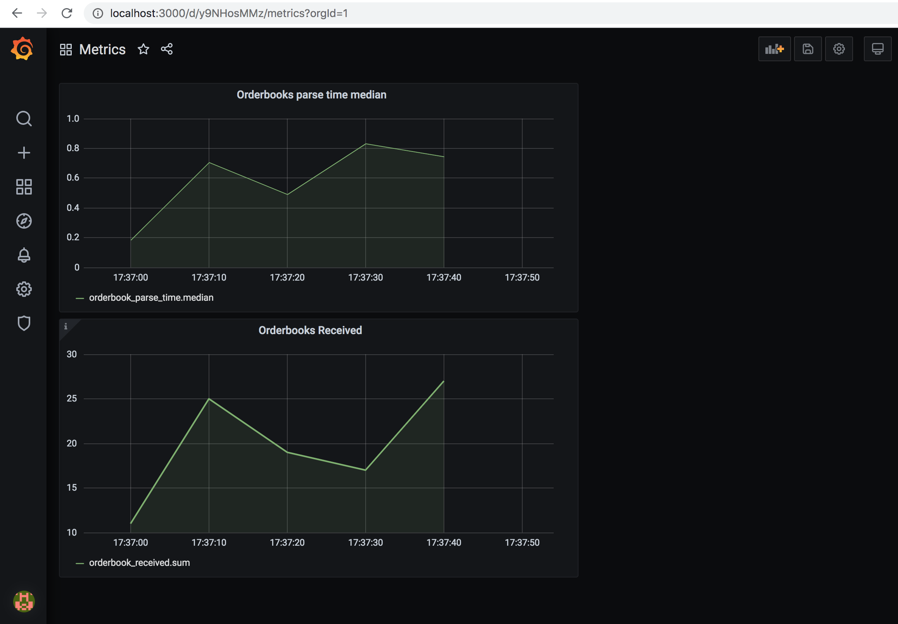

# `orderbook-parser + metrics stack`

Example project that obtains orderbook snapshots from Kraken and pushes metrics related to received orderbooks in influxdb via telegraf with grafana on top.

## How to test

### Run the setup

To start the app and the setup run:

`docker-compose up`  

### Visualization with grafana

Navigate to `localhost:3000` in order to access grafana and use default password: `admin`

Under home in the folder `General` there is a dashboard called `metrics` that contains 2 graph panels for the counter and gauge test cases.

