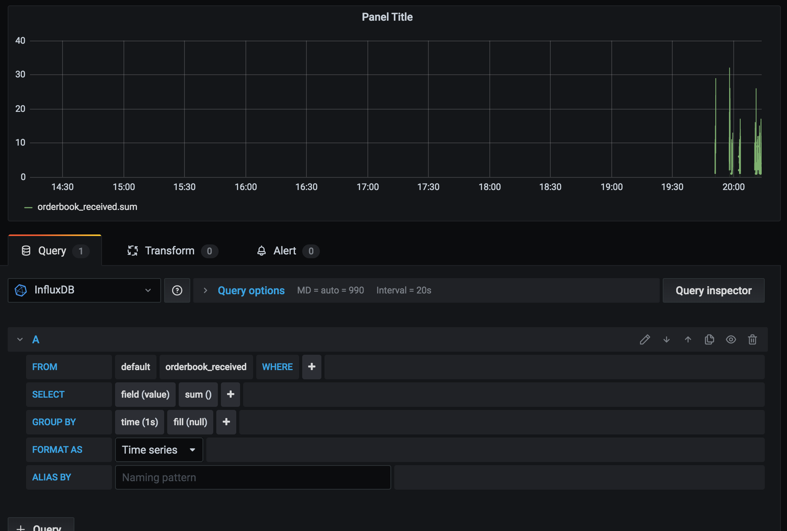

# `orderbook-parser + metrics stack`

Example project that obtains orderbook snapshots from Kraken and pushes metrics related to received orderbooks in influxdb via telegraf with grafana on top.

## How to test

### Build orderbook-parser image

First you need to build the docker image for orderbook-parser app:

`docker build -t imoustak/orderbook-parser:1.0.0 .`

### Run the setup

Then to start the app and the setup run:

`docker-compose up`  

### Visualization with grafana

Navigate to `localhost:3000` in order to access grafana and use default password: `admin`

Select the `create new dashboard` and then `Add new panel`

Example plot:

